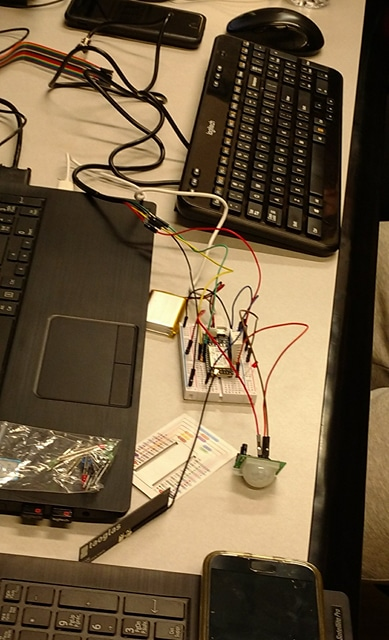
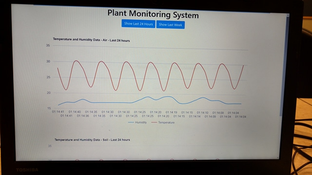

# Critical_Mass_Application
Hello! Thank you for taking the time to review my application for 2018 Critical Mass Summer Developer Internship.
# Work/Project examples
## CalgaryHacks2018
This past weekend (Feb 17th-18th 2018) I participated in the CalgaryHacks 2018 hackathon at U of C. As my first hackathon the experience was a whirlwind of emotions and challenges. Fortunately for me I did not have to go it alone. Working in a team with four other talented developers from my class we were tasked with the theme of long ranged internet of things. We were provided with a particle electron board: a small computer with cellular capabilities and a selection of sensors such as temperature and humidity. With exactly 24 hours to complete the project my role was varied. Initially, I assisted my team in integrating a DHT22 air temperature and humidity sensor to the particle electron by connecting the sensor on the bread board and ensuring it had power and was sending data. Under this tight deadline I also collaborated with my team to build a graphical representation of trends showing the soil and temperature data being received from our sensors on our Express web application. Finally, I took on the role of presenter in the demonstrations and presentation. As a result, our team qualified as one of the top seven teams to move onto the finals and ultimately we finished 6th out of 23 teams. I am left with wonderful memories and confirmation that working in technology is where I need to be. I look forward to many more hackathons in my future. I have included some pictures from the event. 
 

## celiacchat.ca
This project was born out of a conversation with my Mom. My Mom has celiac disease and wanted to start a blog to connect/share experiences with others affected by the disease. Having no web development knowledge herself she asked me if I could help out. Excited by the challenge I agreed to do the full stack development of her blog, https://celiacchat.ca. This is one of my proudest achievements and I think this project is a solid example of my willingness to learn. Having started this project before I started my education at SAIT it was necessary for me to teach myself with only the resources on the internet. After watching many YouTube videos and long nights on stack overflow I slowly started to get a handle of what I needed to do. Ultimately, my curiosity to make the website mobile responsive led me to learn frameworks such as bootstrap. My goal of having comments under each post led me to learn SQL and how to manipulate and store comments in a database (Maria DB). This project has given me confidence in my skills by proving to myself that I am capable of developing and launching a website. 
# Inspiration
## DeepMind
Recently I watched a Netflix documentary titled Alpha GO. This exposed me to DeepMind. It is hard to describe the feeling I experienced after watching the documentary. I didn’t realize how far technology has come. All of a sudden, I could see so many possibilities it was truly inspirational. Using deep neural networks and advanced tree search the DeepMind team was able to train the AlphaGo Computer to beat a world champion human Go player. Throughout the documentary they touched on how AlphaGo’s choices in the game revealed different ways to approach the challenge of beating your opponent. Expanding this to a larger scale it is not hard to see how computers such as these could help humanity view challenges such as climate change and human disease in new and useful ways. Not only this, by understanding how AlphaGo’s neural networks make decisions we could understand more about what it means to be human and how our brains function. For me, getting closer to answering these kinds of questions is extremely exciting!

## Creator of Java
Right now in school I am learning about the object oriented language Java. When I dug a little deeper into the history of Java I discovered that its creator, Dr. James Gosling is from Calgary! To me Dr. Gosling is an inspiration, being the father of such an influential programming language and also being awarded the order of Canada it instills in me the sense that I could do it to. I recently read an article https://www.ucalgary.ca/utoday/issue/2014-03-17/father-java-programming-language-shares-career-wisdom-sold-out-event that he gave a talk at U of C in 2014. I’m sad I missed it but hope that next time he’s around I’ll be able to hear him speak!   

# Focus
I would primarily like to focus on back end programming but am happy to work on front end development as well. I am interested in working with all server side languages and in school have gained entry level knowledge in PHP, JAVA and C#. I’m also trying to teach myself node.js. I would also like to practice working with databases. In school I have learnt about MySQL, SQL server and Oracle but would love a chance to work with databases like MongoDB. I would really enjoy learning more about services like Amazon Web Services as well. Finally, anything related to machine learning and AI would be a bonus for me! 

# Code Challenge
https://codepen.io/SimonF123/pen/xYzVGj
